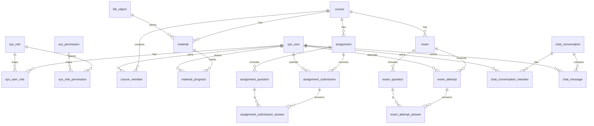

# 01 ER 图与表结构（MySQL 8 / utf8mb4）

> 本文档定义云课堂（CloudClassroom）的核心数据模型。
> 命名规范：小写 + 下划线；主键统一 `bigint`；时间字段 `created_at/updated_at`；软删除 `deleted`。

## 1. 总体说明

- 字符集：`utf8mb4`，排序规则：`utf8mb4_0900_ai_ci`
- 软删除：`deleted`（0=未删除，1=已删除），配合 MyBatis-Plus 逻辑删除
- 常用索引：对外键列、查询条件列建立普通索引；对业务唯一约束建立唯一索引

## 2. ER 图（Mermaid）

> 在 VS Code 里若未渲染，可安装 Mermaid 预览插件；不影响 SQL 执行。

## 3. 表清单（核心字段）

### 3.1 权限与用户

- `sys_user`：用户主表（账号/密码/昵称/状态）
- `sys_role`：角色表（STUDENT/TEACHER/ADMIN）
- `sys_user_role`：用户-角色关联
- `sys_permission`：权限点（例如 `course:create`）
- `sys_role_permission`：角色-权限关联

> 说明：虽然“角色枚举”也能实现，但为了满足 RBAC 要求、后续扩展与展示更清晰，这里落表。

### 3.2 课程

- `course`：课程
- `course_member`：课程成员（学生/老师）

### 3.3 资料与学习进度

- `file_object`：文件元数据（原始文件名/存储路径/大小/类型/sha256）
- `material`：课程资料（绑定 file_object）
- `material_progress`：学习进度（用户+资料唯一）

### 3.4 作业

- `assignment`：作业
- `assignment_question`：作业题目
- `assignment_submission`：作业提交（作业+学生唯一）
- `assignment_submission_answer`：作业答题（提交+题目唯一）

### 3.5 考试

- `exam`：考试
- `exam_question`：考试题目
- `exam_attempt`：考试作答（考试+学生唯一，最小实现一人一次）
- `exam_attempt_answer`：考试答题

### 3.6 私聊

- `chat_conversation`：两人会话
- `chat_conversation_member`：会话成员
- `chat_message`：消息

## 4. 索引与性能要点（最小但有效）

- `sys_user.username`：唯一索引
- `course.teacher_id`：普通索引
- `course_member (course_id, user_id)`：唯一索引
- `material_progress (material_id, user_id)`：唯一索引
- `assignment_submission (assignment_id, student_id)`：唯一索引
- `exam_attempt (exam_id, student_id)`：唯一索引
- `chat_message (conversation_id, id)`：用于分页/拉取历史消息

## 5. 约束说明

- 外键：本项目默认不强制开启外键（避免课堂环境导入失败），但字段与索引按外键设计。
- 时间：全部使用 `datetime(3)`，便于排序与统计。
