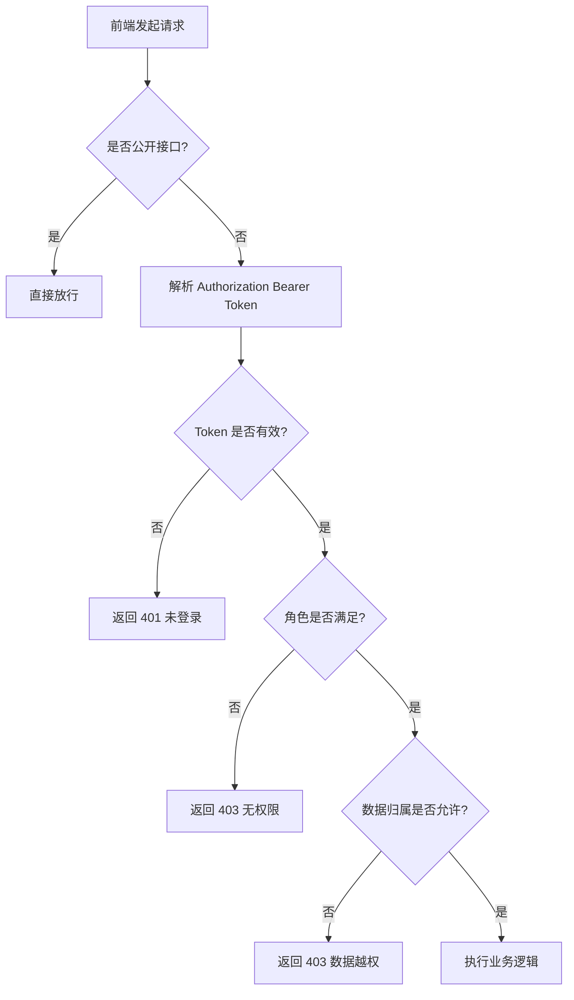

# 01 业务边界与权限模型（RBAC + JWT）

> 本文档用于统一“云课堂（CloudClassroom）”的业务边界、数据归属与接口权限点。
> 后续数据库 ER 图、建表、后端接口与前端路由均以本文档为准。

## 1. 角色定义

系统内置三类角色：

- 学生（STUDENT）：选课、学习资料、完成作业、参加考试、私聊沟通。
- 老师（TEACHER）：创建课程、管理课程成员、发布资料、布置作业、组织考试、批改与统计。
- 管理员（ADMIN）：平台级用户管理、课程审计与全局配置（可选，最小实现可以保留但不做复杂页面）。

> 说明：注册时允许选择“学生/老师”。管理员可通过数据库或后端初始化脚本创建。

## 2. 核心业务对象（领域模型）

为保证前后端分离开发可控，本项目按以下领域对象拆分：

### 2.1 用户与身份

- 用户（User）：账号、密码（加密存储）、昵称、角色、头像、状态。
- 登录会话（JWT）：无状态；通过请求头携带。

### 2.2 课程

- 课程（Course）：由老师创建；课程包含多名学生。
- 选课关系（CourseMember）：学生加入课程（老师可添加/移除）。

### 2.3 作业

- 作业（Assignment）：属于课程，由老师发布。
- 作业提交（AssignmentSubmission）：学生在截止前提交；老师批改评分。
- 作业题目（AssignmentQuestion）：客观题/主观题（最小可先支持客观题）。

### 2.4 学习资料与学习进度

- 资料（Material）：属于课程，类型包括：PPT、DOCX、PDF（以“文件 + 类型”方式存储）。
- 资料学习进度（MaterialProgress）：按“用户 + 资料”记录进度（百分比、最近阅读时间）。

> 进度规则：
> - 服务端以“提交的阅读进度事件”更新（防刷：按时间/增量校验，后续安全阶段加强）。
> - 前端展示“已学习/未学习/学习中”。

### 2.5 考试

- 考试（Exam）：属于课程，有开始/结束时间。
- 试题（ExamQuestion）：单选/多选/判断（最小可先单选/判断）。
- 试卷作答（ExamAttempt）：学生一次考试一次作答记录。

### 2.6 私聊

- 会话（ChatConversation）：两人会话。
- 消息（ChatMessage）：文本为主（最小实现）；后续可扩展文件。

> 实现方式（第一阶段）：HTTP 轮询拉取未读消息（稳定、易实现、适配手机端）。

## 3. 数据归属与访问边界（非常重要）

### 3.1 课程数据归属

- 课程的“拥有者”= 创建该课程的老师。
- 老师只能管理自己创建的课程（除非 ADMIN）。

### 3.2 成员数据边界

- 学生只能看到自己加入的课程。
- 学生只能提交属于自己课程的作业/考试。

### 3.3 作业与考试数据边界

- 老师可查看/批改本课程所有学生的提交。
- 学生仅能查看自己的提交与成绩（不允许查看他人）。

### 3.4 私聊数据边界

- 仅会话双方可读取消息。
- 仅发送方可撤回自己的消息（最小可不做撤回）。

## 4. 权限模型（RBAC）

### 4.1 设计目标

- 简单可控：以角色（学生/老师/管理员）为主；结合“数据归属校验”解决同角色下的边界问题。
- 可扩展：后续若需要细粒度权限，可引入“权限点 + 角色权限关联”。

### 4.2 权限校验规则

请求进入后端后按顺序校验：

1. 是否放行接口（注册、登录、Swagger 静态资源等）。
2. JWT 是否存在、是否有效、是否过期。
3. 角色是否满足（STUDENT/TEACHER/ADMIN）。
4. 数据归属校验（例如课程是否属于当前老师、学生是否是课程成员）。

> 说明：第 4 点是本项目最容易出错的地方，必须在 Service 层做强制校验。

### 4.3 权限点（接口级）清单（第一阶段最小可用）

以下为“必须有”的权限点集合，用于后续 Controller 与前端路由守卫。

#### 4.3.1 认证

- `POST /api/auth/register`：匿名
- `POST /api/auth/login`：匿名
- `GET /api/auth/me`：登录用户（STUDENT/TEACHER/ADMIN）

#### 4.3.2 用户管理

- `GET /api/users`：ADMIN（分页/条件筛选）
- `PUT /api/users/{id}/status`：ADMIN
- `PUT /api/users/me/profile`：登录用户

#### 4.3.3 课程

- `POST /api/courses`：TEACHER
- `GET /api/courses`：登录用户（按角色返回“我创建/我加入”的课程列表）
- `GET /api/courses/{courseId}`：课程成员或课程拥有者
- `POST /api/courses/{courseId}/members`：TEACHER（仅拥有者）
- `DELETE /api/courses/{courseId}/members/{userId}`：TEACHER（仅拥有者）

#### 4.3.4 资料与进度

- `POST /api/courses/{courseId}/materials`：TEACHER（仅拥有者）
- `GET /api/courses/{courseId}/materials`：课程成员或课程拥有者
- `POST /api/materials/{materialId}/progress`：STUDENT（仅本人）

#### 4.3.5 作业

- `POST /api/courses/{courseId}/assignments`：TEACHER（仅拥有者）
- `GET /api/courses/{courseId}/assignments`：课程成员或课程拥有者
- `POST /api/assignments/{assignmentId}/submit`：STUDENT（仅本人）
- `GET /api/assignments/{assignmentId}/submissions`：TEACHER（仅拥有者）
- `PUT /api/submissions/{submissionId}/grade`：TEACHER（仅拥有者）

#### 4.3.6 考试

- `POST /api/courses/{courseId}/exams`：TEACHER（仅拥有者）
- `GET /api/courses/{courseId}/exams`：课程成员或课程拥有者
- `POST /api/exams/{examId}/start`：STUDENT（仅本人）
- `POST /api/exams/{examId}/submit`：STUDENT（仅本人）
- `GET /api/exams/{examId}/results`：TEACHER（仅拥有者）

#### 4.3.7 私聊

- `GET /api/chats/conversations`：登录用户
- `POST /api/chats/conversations`：登录用户（创建或获取两人会话）
- `GET /api/chats/conversations/{conversationId}/messages`：会话成员
- `POST /api/chats/conversations/{conversationId}/messages`：会话成员

## 5. JWT 设计

### 5.1 Header 约定

- 请求头：`Authorization: Bearer <token>`

### 5.2 Token 载荷（Claims）建议

- `sub`：用户 ID
- `role`：角色（STUDENT/TEACHER/ADMIN）
- `name`：昵称（可选）
- `iat/exp`：签发/过期时间

### 5.3 过期与刷新策略

- 第一阶段最小可用：Access Token 2 小时过期，重新登录获取。
- 若需要增强：再加入 Refresh Token（后续可扩展，不作为第一阶段必做）。

## 6. 权限流程图（Mermaid）

## 7. 与后续实现的映射

- 数据库阶段：会把“角色、课程成员、作业提交、资料进度、考试作答、私聊消息”落到表结构，并加必要索引。
- 后端阶段：Controller 只做参数接收与返回；权限与归属校验放 Service 层；统一返回体与异常在全局处理。
- 前端阶段：路由守卫按 `role` 控制页面入口；接口按 401/403/业务错误统一提示。
